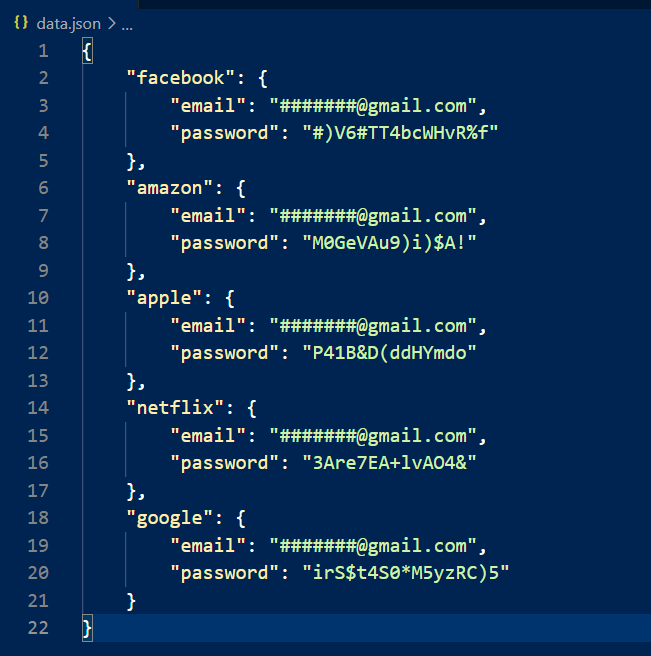
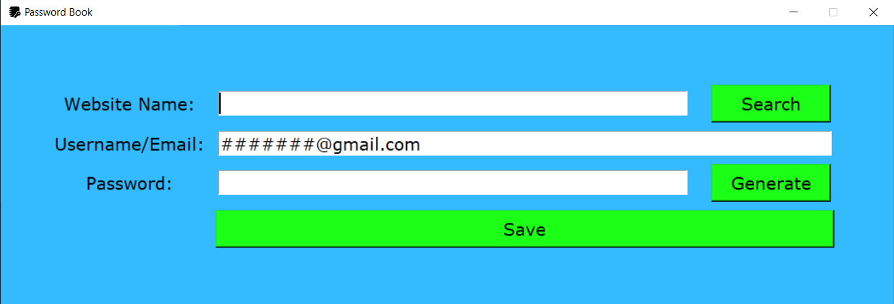
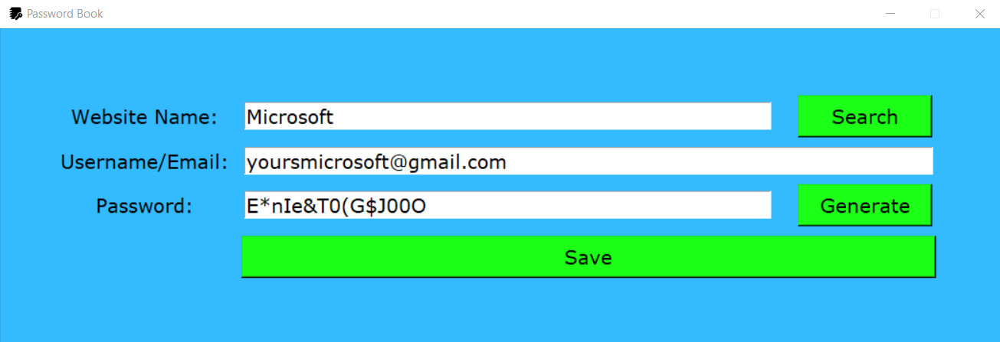
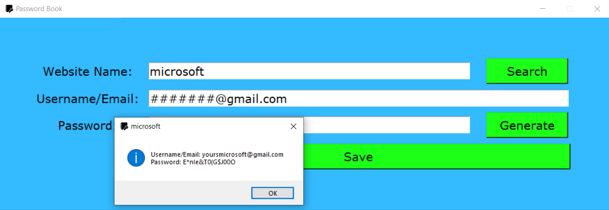

# Password-Book
* This is a desktop app in which you can generate a random password for any website and save your password. Here all the passwords will save locally on your PC.

> Features
* Generate a Password
* Search for a Saved Password
* Automatically copy a password on Clipboard

> Usage
* Enter the name of the website for which you want to generate password or save password.
* Enter the username/email for the website.
* Enter the passoword or generate the password and save it. 
* And here you can search for particular websites password by entering websites name in the corresponding field.

> And as you save the password, it will be saved in a json file as shown below.

> GUI

